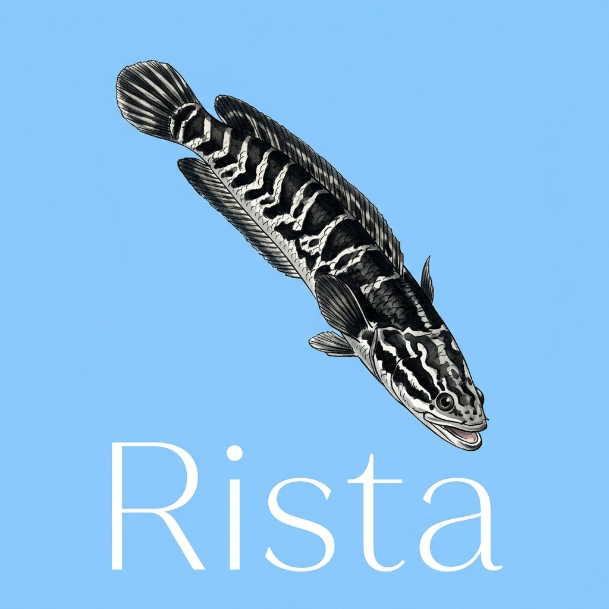
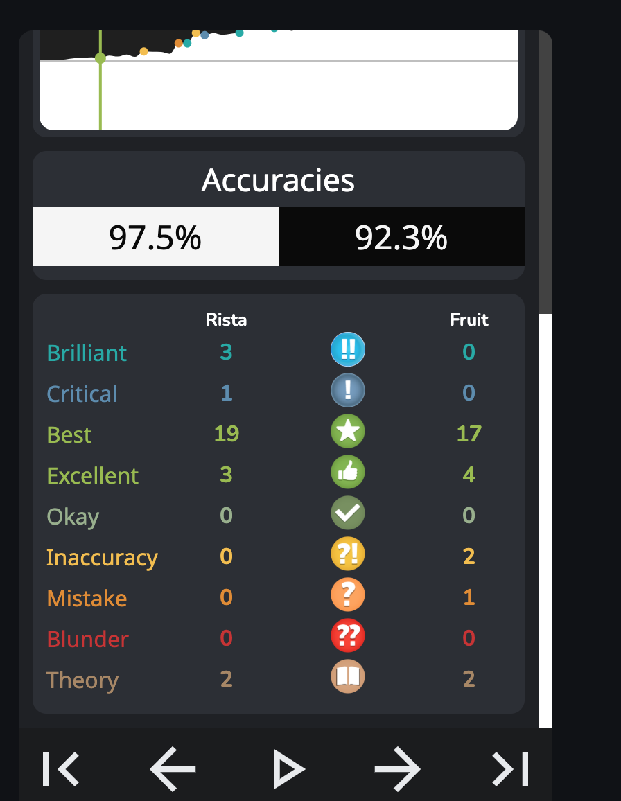
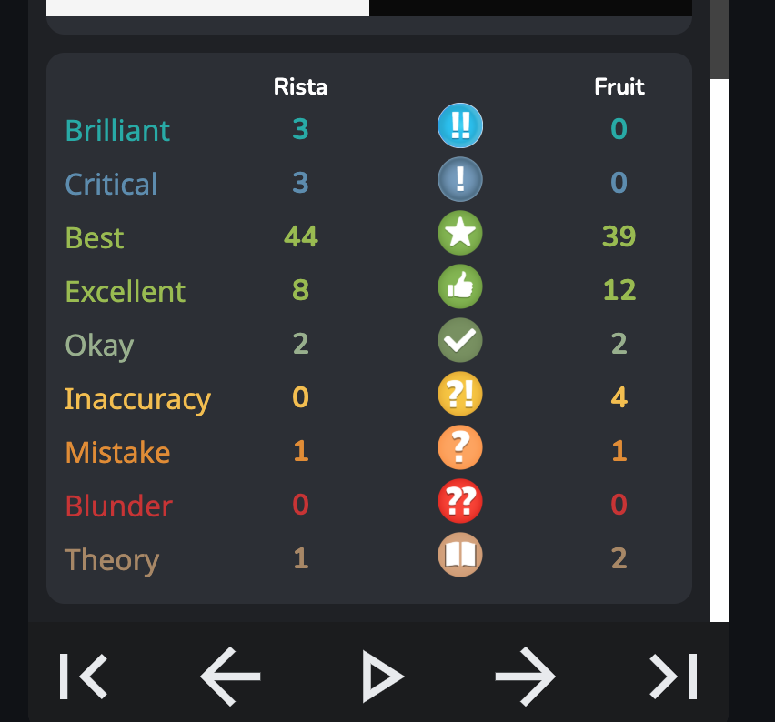

# 🐟 Rista Chess Engine - Sát Thủ Cờ Vua Lấy Cảm Hứng Từ Loài Cá Lóc!

<div align="center">
  
</div>

Chào mừng bạn đến với **Rista**, một Chess Engine được viết hoàn toàn bằng **C++ siêu tốc độ**, kết hợp với một chiếc GUI xinh xắn bằng **Python Tkinter**. Nếu bạn đang tìm kiếm một con bot cờ vua có khả năng tính toán vượt trội, thích "đập" luôn cả các bot khác, thì bạn đến đúng chỗ rồi đấy!

---

## 🏆 Chiến tích của Rista (Đại chiến với Fruit 2.1)
Rista không chỉ là "chuyên gia múa Hậu" mà còn có khả năng tìm ra những nước đi Brilliant (!!) cực kỳ ảo diệu. Trong trận đấu lịch sử với Engine gạo cội **Fruit 2.1**, Rista (phiên bản 3.3) đã thể hiện đẳng cấp vượt trội:

- **Độ chính xác (Accuracy) khủng khiếp:** Luôn dao động từ 96% đến 97.5%, không chừa cho đối thủ một con đường sống.
- **Nước đi Brilliant (!!):** Rista liên tục tung ra những đòn phối hợp chiến thuật, hiến quân sắc lẹm khiến Fruit 2.1 cũng phải "mù mắt".

Dưới đây là một số hình ảnh chứng minh sức mạnh của bé Cá Lóc nhà ta trên bàn cờ:

<table align="center">
  <tr>
    <td></td>
    <td></td>
  </tr>
  <tr>
    <td></td>
    <td></td>
  </tr>
</table>

---

## 🚀 Tính năng nổi bật và Các Thuật Toán Xương Sống

Đằng sau khả năng di chuyển linh hoạt của Rista là một hệ thống thuật toán C++ được tối ưu đến từng bit:

- **Kiến trúc Lõi C++ Bitboard**: Thay vì dùng mảng 2 chiều truyền thống, Rista biểu diễn toàn bộ bàn cờ bằng các số nguyên 64-bit (Bitboards). Việc này cho phép nó thực hiện các phép toán logic học bit (AND, OR, XOR) để sinh nước đi cực kỳ thần tốc.
- **Sinh Nước Đi (Move Generation)**: Bắt quân trượt, nhập thành, phong cấp, và ăn tốt qua đường (En Passant) chuẩn xác và cực kỳ tối ưu qua Magic Bitboards.
- **Thuật Toán Tìm Kiếm & Cắt Tỉa (Search & Pruning)**:
  - **Negamax & Alpha-Beta Pruning**: Thuật toán cốt lõi giúp Rista xây dựng cây trò chơi, giả định đối thủ luôn đi nước cờ hoàn hảo nhất để tìm ra chuỗi nước đi tối ưu, đồng thời cắt tỉa đi hàng triệu nhánh vô vọng mà không cần xét tới.
  - **Quiescence Search**: Chống lại căn bệnh nan y "Horizon Effect" (Mù chân trời). Thuật toán này buộc Rista phải tìm kiếm sâu thêm (chỉ xét các nước ăn quân) ở cuối cây để đảm bảo không bỏ sót các pha giăng bẫy bắt hậu.
  - **ProbCut**: Rista sẽ thử đánh giá nhanh một nhánh ở độ sâu nông hơn. Nếu kết quả quá tệ hoặc quá tốt so với ngưỡng, nó lập tức "chặt đứt" luôn nhánh đó để tiết kiệm thời gian cho các nước đi tiềm năng hơn.
  - **SEE (Static Exchange Evaluation) Pruning**: Hàm đánh giá tĩnh xem xét một pha trao đổi quân trên bàn cờ. Nhờ SEE, Rista biết từ chối những pha hiến quân mù quáng (ví dụ: lấy Hậu đi ăn Chốt có bảo vệ) để không tốn Node tính toán.
  - **Capture History**: Rista học hỏi từ quá khứ! Nếu một đòn ăn quân ở nhánh trước đó gây ra sự thay đổi điểm số đột biến (Cutoff), nó sẽ ưu tiên xét nước đi đó đầu tiên ở các nhánh tiếp theo.
- **Transposition Table (Bộ Nhớ Băm Zobrist Hashing)**: Gắn mỗi thế cờ một mã ID 64-bit độc nhất. Nhờ vậy, nếu Rista gặp lại một thế cờ cũ thông qua một chuỗi nước đi khác, nó sẽ lấy luôn kết quả từ bộ nhớ thay vì phải vắt óc tính lại từ đầu.
- **Sách Khai Cuộc (Opening Book)**: Tự động tra cứu tệp định dạng Polyglot `.bin` để đa dạng hoá khai cuộc, giúp Rista không bị bắt bài.

---

## 🎮 Giao Diện Python GUI (Rista GUI) Đa Năng

Rista đi kèm với một giao diện `rista_gui.py` cực kỳ đa năng. Nó không chỉ là nơi bạn đọ sức, mà còn là một đấu trường thực thụ:

- **Đấu Trường Của Các Engine (PvE)**: Bạn có thể mời **tất cả các Chess Engine chuẩn UCI khác** (như Stockfish, Fruit 2.1, Sunfish...) vào làm khách mời đặc biệt! Rista GUI sẽ đứng ra làm trọng tài tổ chức trận huyết chiến giữa Rista và các Engine này để xem ai mới là kẻ mạnh nhất.
- **Tương Tác Kéo-Thả (Drag & Drop) Mượt Mà:** Chơi cờ như một con người thực sự, kéo thả quân cờ cực kỳ trực quan với màu sắc êm dịu, không hề có độ trễ.
- **Theo Dõi Tư Duy Rista (Engine Log):** Khung Log Terminal tích hợp ngay trong GUI hiển thị "não bộ" của Rista theo thời gian thực (Độ sâu Depth, Điểm số Centipawns, Tốc độ Nodes/giây, và Principal Variation - nhánh cờ tối ưu đang được ủ mưu).

### Câu chuyện về sự tiến hóa của Rista
Ngày xửa ngày xưa, ở những phiên bản đầu, Rista từng bị một **Bug rò rỉ điểm Material Score trí mạng** (Mỗi lần nhẩm tính nước Phong Cấp ảo, nó tự trừ của mình đi 100 điểm cho đến khi điểm âm vô cực). Điều này khiến Rista bị trầm cảm và tự nguyện dâng Tốt đi tự sát. 
Nhưng trải qua một buổi chẩn đoán gắt gao, chúng tôi đã "chữa lành" cho Rista. Bằng kiến trúc C++ vượt trội và thuật toán tối ưu, Rista giờ đây tính trước tận Depth 6-7 chỉ trong chớp mắt, liên tục hạ nốc ao các Engine đối thủ một cách không thương tiếc! 🏆

---

## 🛠 Hướng Dẫn Cài Đặt Và Sử Dụng

### 1. Biên dịch C++ Engine
Đầu tiên, hãy gọi hồn con cá lóc bằng cách biên dịch mã nguồn C++:
```bash
make clean && make -j4
```
*(Yêu cầu trình biên dịch hỗ trợ C++20)*

### 2. Khởi chạy Giao Diện
Và giờ là lúc mở giao diện lên để tận hưởng:
```bash
python3 gui/rista_gui.py
```

---

## 🧠 Lời Cảm Ơn (Acknowledgments)
Dự án Rista vinh dự được kế thừa và học hỏi từ những người khổng lồ trong giới mã nguồn mở:
- **Stockfish Team & Cộng Đồng**: Cảm ơn các bạn đã cung cấp công cụ huấn luyện [nnue-pytorch](https://github.com/official-stockfish/nnue-pytorch) và chia sẻ các kho dữ liệu (Dataset) khổng lồ trên HuggingFace. Những tài nguyên này là cốt lõi để Rista tiếp tục tiến hóa.

---
**Rista** - Không chỉ là cờ vua, đó là nghệ thuật của sự tiến hóa từ lỗi lầm (và sự ưu việt của C++ trước Python)! 😉
